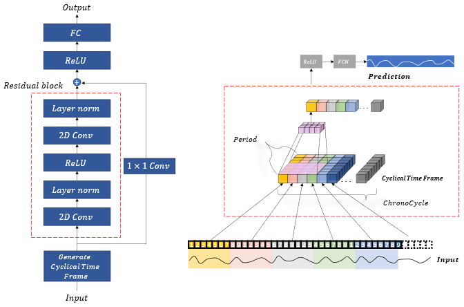

# ChronoPatternNet
*Revolutionizing Electricity Consumption Forecasting with Advanced Temporal Pattern Recognition and Efficient Computational Design*

-----
Contributions:
1. Superior Pattern Recognition: Excels in handling complex electricity usage data.
2. Long-Term Forecasting: Achieves exceptional accuracy in long-term predictions, a traditionally challenging area.
3. Reduced Error Rates: Demonstrates 7.7% to 36.4% lower error rates compared to existing models.
4. Computational Efficiency: Features 58.8% to 61.9% reduction in parameter count, enhancing operational efficiency.
5. Versatility in Time Series Forecasting: Offers significant improvements for real-time applications in energy management and forecasting.
-----


**Figure 1**. The architecture of ChronoPatternNet


# Requirements
Dependencies can be installed using the following command:
```shell
pip install -r requirements.txt
```
# Datasets

In this paper, we experimented on 4 datasets

| Dataset  | Length | No. Variables | Attributions                                                                                                       |
|----------|--------|---------------|--------------------------------------------------------------------------------------------------------------------|
| [Spain-household](https://paperswithcode.com/dataset/energy-consumption-curves-of-499-customers)    | 8,760  | 2             | Energy consumption, Outside temperature                                                                            |
| [GyDataset](https://huggingface.co/datasets/andrewlee1807/Gyeonggi) | 17,001 | 1             | Energy consumption                                                                                                 |

# Usage
- Commands for training and testing the ChronoPatternNet on Gy dataset:
```shell
python main.py
    --dataset_name="GYEONGGI9654"
    --output_dir="benchmark/exp/gy/delay1"
    --config_path="config/chrono/gyeonggi_9654.yaml"
    --output_length=1
    --device=0
    --features="amount-of-consumption"
    --prediction_feature="amount-of-consumption"
```


We provide ability to custom the ChronoPatternNet model to fit different purposes. Here is the example of `gyeonggi_delay1.yaml` file configuration for Gyeonggi data.
```yaml
#INITIAL SETTINGS
kernel_size: 5
chrono_cycle_factor: 7 # = input/period: how long in the past reference
gap: 24       # distance kernal mask
nb_filters: 16  # Number of filters 
nb_stacks: 2 # Number of Delayed block, minimum=1
input_width: 168
train_ratio: 0.9 # Train and Test dataset (in this case: 90% using for Train and 10% for Testing)
epochs: 10
optimizer: "adam"
metrics: [ 'mse', 'mae' ]
```

# Reproducibility

Besides, the experiment parameters of each data set are formated in the `.sh` files in the directory `./shell_gyeonggi/` and `./shell_spain`.
```shell
./shell_gyeonggi # experiment for gyeonggi dataset
./shell_spain # experiment for spain dataset
```

```
├── shell_gyeonggi 
│   ├── execute_arima_gyeonggi9654.sh
│   ├── execute_chronopattennet_gyeonggi9654.sh
│   ├── execute_gru_gyeonggi9654.sh
│   ├── execute_lstm_gyeonggi9654.sh
│   ├── execute_mlp_gyeonggi9654.sh
│   └── execute_tcn_gyeonggi9654.sh
├── shell_spain
│   ├── execute_arima_spain.sh
│   ├── execute_chronopattennet_spain.sh
│   ├── execute_gru_spain.sh
│   ├── execute_lstm_spain.sh
│   ├── execute_mlp_spain.sh
│   └── execute_tcn_spain.sh
```

- (Optional) Set Linux Commands to Run in the Background Using disown:
    ```shell
    tmux new -d 'sh shell_gyeonggi/execute_chronopattennet_gyeonggi9654.sh > output.log'
    ```

# Citation

```
@inproceedings{anhle-ChronoPatternNet-2023,
  author    = {Le Hoang Anh, Soo Chang Lee , Yu Gwanghuyn, Kim Jin Young},
  title     = {ChronoPatternNet: Revolutionizing Electricity Consumption Forecasting with Advanced Temporal Pattern Recognition and Efficient Computational Design},
  booktitle = {},
  volume    = {},
  number    = {},
  pages     = {},
  publisher = {{} Press},
  year      = {2023},
}
```